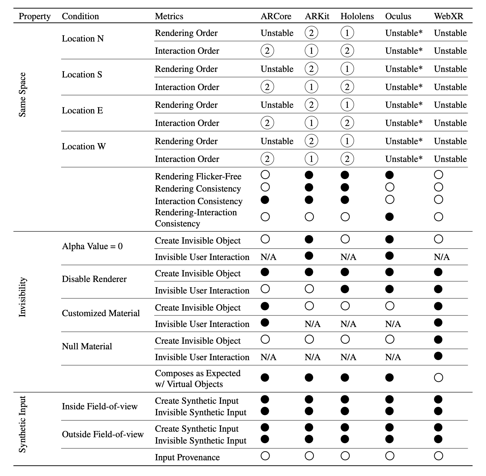

<center>

</center>

## When the User Is Inside the User Interface: An Empirical Study of UI Security Properties in Augmented Reality
Authors: Kaiming Cheng, Arka Bhattacharya, Michelle Lin, Jaewook Lee, Aroosh Kumar, Jeffery F. Tian, Tadayoshi Kohno, Franziska Roesner

Appears in *USENIX Security 2024*. 
[Project page](https://ar-sec.cs.washington.edu/ar_ui/)


# Appendix Abstract

## Introduction
This artifact includes two main components: 

### Part 1 -- Property 
The test code AR UI properties on five leading XR platforms (ARCore, ARKit, Hololen2 Oculus, WebXR). Each platform has its own folder. Inside the folder, we included the README and the test code for three AR UI properties:
* **Same Space Property**: How do AR systems manage objects that share the same physical world mapping? For instance, when two AR objects with identical shapes and sizes are anchored at the same 3D coordinates, which object(s) become visible to the user? Which receive(s) the user’s input?
* **Invisibility Property**: How do AR systems handle virtual objects
in the AR world that are transparent? To what extent, if any, does an object’s visibility influence its functionality? For example, are transparent objects capable of receiving user input? What happens when a transparent object renders over another virtual object?
* **Simulated Raycast Property**: How do AR systems handle synthetic user input? For example, can adversarial code generate synthetic input to mimic human interaction, such as via a programmatically generated raycast? 


### Part 2 -- Proof-of-concept attacks
The proof-of-concept video for five attacks. [Demo Link](https://ar-sec.cs.washington.edu/ar_ui/)
* Input forgery attack on ARCore 
* Clickjacking attack: Implemented on ARKit 
* User input denial-of-service attack on Hololens 
* Object-in-the-middle attack on Oculus
* Object erasure attack on WebXR 

## Prerequisites

Please ensure you have the following environments set up with all the dependencies
to be able to reproduce the artifacts in the paper. 

#### ARCore
Hardware: Requires an Android device with support for ARCore. The full list of ARCore-supported devices can be found in https://developers.google.com/ar/devices. <br>
Software: We built our test cases using ARCore v1.32.0 for AR functionalities and Sceneform SDK v1.20.5 for 3D content rendering.
> Note: The Sceneform SDK is no longer supported by Google at the time this paper is published. 

#### ARKit
Hardware: Requires an iOS device with an A9 or later processor. <br> 
Software: We built our test cases using ARKit and RealityKit for necessary AR functionalities.  

#### Hololens
Hardware: Hololens 2<br>
Software: We built our three test cases using Mixed Reality Toolkit (MRTK) 2.0 and Unity 2021.3.16f1.

#### Oculus
Hardware: Requires a passthrough-enabled Oculus headset, such as Oculus 2, Oculus Pro, or Oculus 3
Software: We built our three test cases using Oculus Integration SDK v44.0 and Unity version 2021.3.25f1.

#### WebXR
Hardware: Requires a WebXR-compatible browser (Chrome) on an ARCore-supported device. <br>
Software: We built our test cases using Three.js and WebXR API for necessary AR functionalities.


## Property Experiment Results 
<center>

</center>
The evaluation metrics are lised in the above figure. Each README provides instructions on how to reproduce our results.

[ARCore](Property_Code/ARCore/README.md)
[ARKit](Property_Code/ARKit/README.md)
[Hololens](Property_Code/Hololens/README.md)
[Oculus](Property_Code/Oculus/README.md)
[WebXR](Property_Code/WebXR/README.md)

 </br>

## Camera-ready version
See attached `paper.pdf`.

### Citation

```
@inproceedings{cheng2024arui,
            title={When the User Is Inside the User Interface:
              An Empirical Study of UI Security Properties in Augmented Reality,
              author={Cheng, Kaiming and Tian, Jeffery F and Kohno, Tadayoshi and Roesner, Franziska},
              booktitle={USENIX Security},
            year={2024}
          }
```
